# Services

## Introduction
Imagine, [World Wide Importers](https://docs.microsoft.com/en-us/sql/sample/world-wide-importers/overview) has an existing code base to order items from suppliers. In this lab we want to refactor our code because
* it's full of if statements to implement the business rules
* it contains supplier specific code mixed with core logic
* if we or the supplier is offline orders are lost and have to be resent manually
* it is hard to test

We will target those drawbacks by
* using queues for order messages
* using an Azure Function App for notifying a supplier about a new order
* using an Azure Logic App for implementing an approval workflow for price changes

## Using queues for order messages

### Create a Service Bus queue
* Log in to your Azure portal and create a new *Service bus*

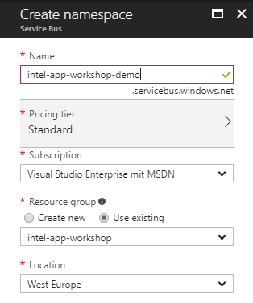

* Discuss the [differences between *queues* and *topics*](https://docs.microsoft.com/en-us/azure/service-bus-messaging/service-bus-queues-topics-subscriptions)
* Create a new *topic* named *orders*. This topic will contain all the order messages, *filtered subscriptions* can be used to notify suppliers about new orders. 

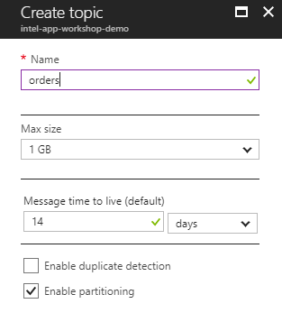

## Notify suppliers
The queue contains order messages for different suppliers. Based on the supplier id we want to implement a custom logic to order: sometimes a mail will be sent, sometimes the supplier will provide a webservice for that. In the past this code was part of the core codebase, now we will implement an Azure Function App and automatically call it whenever an order message arrives.

### Create a filtered subscription
* Let's create a filtered subscription to get notified whenever an order message for a specific supplier arrives. The subscription will be created by a small console application (see *OrderSimulator*). 
* [*Shared access signature* (SAS)](https://docs.microsoft.com/en-us/azure/service-bus-messaging/service-bus-sas) are used to authenticate to a Service bus topic. Depending on the SAS settings you are able to listen, write or manage.
* Select the newly created topic and create a SAS (see *Shared access policies*).
* Name it *OrderSimulator* and choose *Manage* to be able to create new subscriptions with this SAS.

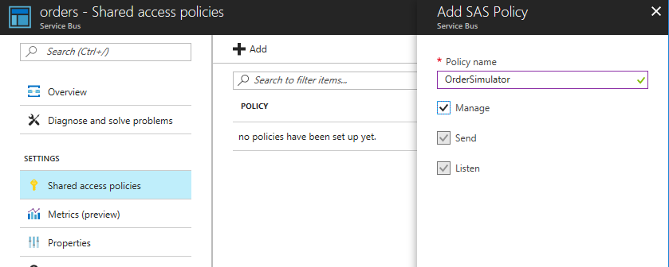

* Click on the newly created SAS and copy the *Primary Connection String* for further use.

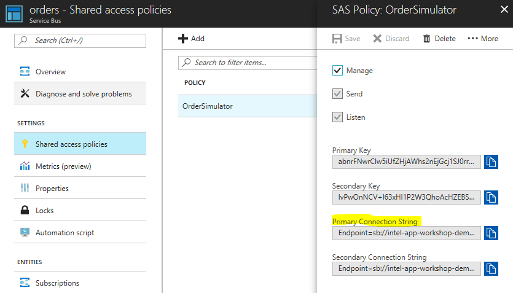

* Execute the provided console application *OrderSimulator* to create a new filtered subscription 

```
L:\>OrderSimulator --help
OrderSimulator 1.0.0.0
Copyright ©  2017

  send       Send a new order message to the topic.

  create     Create a new filtered subscription

  help       Display more information on a specific command.

  version    Display version information.
```

```
L:\>OrderSimulator create
OrderSimulator 1.0.0.0
Copyright ©  2017

  -s, --supplierid           (Default: 4) Supplier id that the subscription is filtered to

  -n, --subscription-name    Required. Name of the subscription to create

  -c, --connectionstring     Required. Connection string to an existing Service bus topic

  -t, --topic                Required. Name of an existing topic

  --help                     Display this help screen.

  --version                  Display version information.
```


> Please be aware that the connection string copied from the Azure portal contains the *EntityPath* parameter and it mustn't be provided in the OrderSimulator.

```
L:\>OrderSimulator create 
    -s 4 
    -n Supplier4Notifications 
    -c "Endpoint=sb://intel-app-workshop-demo.servicebus.windows.net/;SharedAccessKeyName=OrderSimulator;SharedAccessKey=xxx" 
    -t orders
```

The code for creating a subscription (see [OrderSimulator/Program.cs](OrderSimulator/Program.cs)):

```cs
private static void CreateSubscriptionFilter(CreateSubscriptionOptions options)
{
    var namespaceManager = NamespaceManager.CreateFromConnectionString(options.ConnectionString);

    var subscription = new SubscriptionDescription(options.TopicName, options.SubscriptionName)
    {
        DefaultMessageTimeToLive = TimeSpan.FromDays(7),
        LockDuration = TimeSpan.FromMinutes(1),
        MaxDeliveryCount = 10,
        EnableDeadLetteringOnFilterEvaluationExceptions = true
    };

    var filter = new SqlFilter($"user.SupplierID = '{options.SupplierID}'");

    namespaceManager.CreateSubscription(subscription, filter);

    Console.WriteLine($"Created subscription {options.SubscriptionName} on topic {options.TopicName}.");
}
```


### Create an Azure Function App
* Create a new *Function App* in your Azure portal

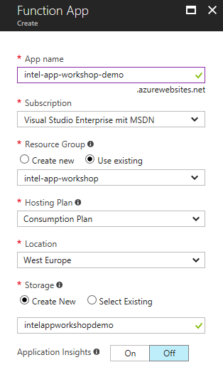

* Create a new *Function*
* Choose *Get started on your own* and click on *Custom function*

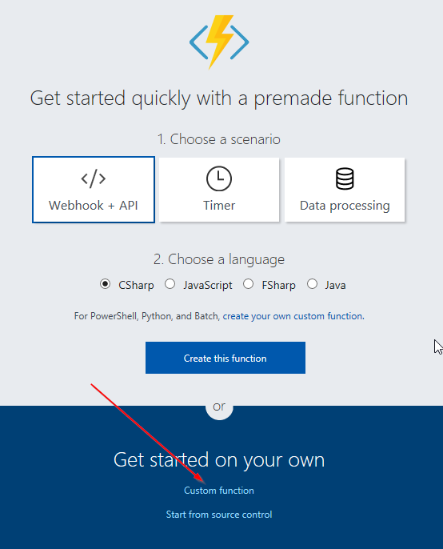

* Select the *ServiceBusTopicTrigger - C#* template
* Name your function *NotifySupplier4*
* Set up the *Service Bus connection*
* Set the *Topic name* and the *Subscription name*

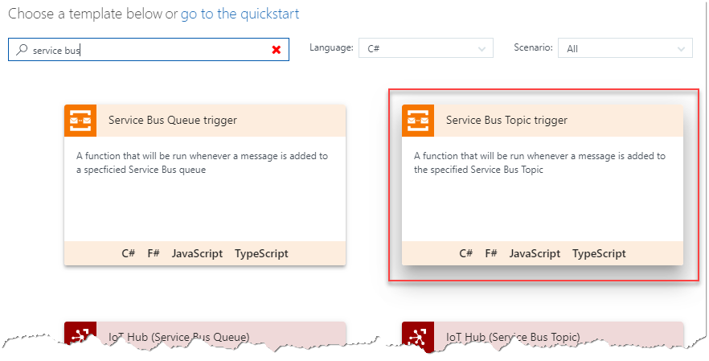

* Implement the supplier specific interface, maybe by sending a test request to (requestb.in)[https://requestb.in]

```cs
#r "Newtonsoft.Json"

using System;
using System.Net.Http;
using System.Threading.Tasks;
using Newtonsoft.Json;

public static async Task Run(string mySbMsg, TraceWriter log)
{
    var data = JsonConvert.DeserializeObject<Order>(mySbMsg);

    var supplierMessage = $"{data.Quantity};{data.StockItemID};{data.Quantity * data.PricePerItem}";
    log.Info(supplierMessage);

    using (var client = new HttpClient())
    {
        await client.PostAsync("https://requestb.in/1b04y8z1", new StringContent(supplierMessage));
    }
}

public class Order
{
    public int StockItemID { get; set; }
    public int Quantity { get; set; }
    public decimal PricePerItem { get; set; }    
}
```

### Test the Function App
* Whenever a message for supplier 4 is inserted in the queue, your Function App should be executed.
* Use the provided console application for inserting a new message to your queue

```
L:\>OrderSimulator send
OrderSimulator 1.0.0.0
Copyright ©  2017

  -s, --supplierid          (Default: 4) Supplier id that the subscription is filtered to

  -c, --connectionstring    Required. Connection string to an existing Service bus topic

  -t, --topic               Required. Name of an existing topic

  --help                    Display this help screen.

  --version                 Display version information.
```

> Please be aware that the connection string copied from the Azure portal contains the *EntityPath* parameter and it mustn't be provided in the OrderSimulator.

```
L:\>OrderSimulator send -s 4 -c "Endpoint=sb://intel-app-workshop-demo.servicebus.windows.net/;SharedAccessKeyName=OrderSimulator;SharedAccessKey=abnrFNwrClw5iUfZHjAWhs2nEjGcj1SJ0rrREDUTLKw=" -t orders
{ StockItemId = 81, StockItemName = "The Gu" red shirt XML tag t-shirt (White) M, SupplierID = 4, SupplierName = Fabrikam, Inc., Quantity = 100, PricePerItem = 18 }

Order successfully sent!
```

* After a few seconds, your (requestb.in)[https://requestb.in] should show the incoming request: your supplier is notified about the new order message.

## Create a Logic App to implement a price change workflow
* Imagine, that the supplier gets your order - but the price of the article has changed and he needs an updated order. We want to provide a service endpoint for this scenario so that the supplier can send an approval request. *Azure Logic Apps* are a good way of creating flexible workflows by using existing building blocks.
* Create a new *Azure Logic App*

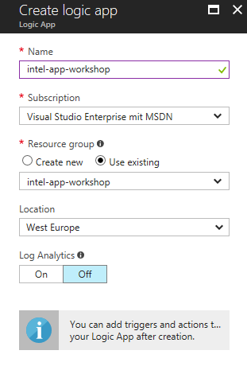

* Choose the template *When a HTTP request is received" as your start


* Click on *New step* and *Add an action* to add the first step in your workflow.

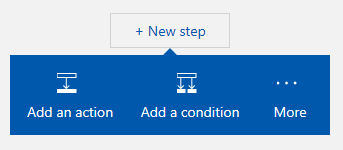

* Choose the *Data Operations - Parse JSON* operation

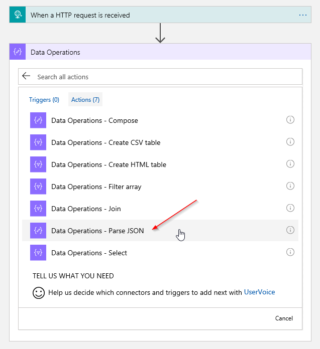

* Select the *Body* content of your HTTP request as the *Content* for your Parse JSON operation


* Click on *Use sample payload to generate schema* and copy the below JSON to generate your schema.

```json
{
  "StockItemId": 80, 
  "StockItemName": "The Gu red shirt XML tag t-shirt (White) M", 
  "SupplierID": 4, 
  "SupplierName": "Fabrikam, Inc.", 
  "Quantity": 100, 
  "PricePerItem": 18.0 
}
```

* We want to send an approval email through Office 365


* Sign in using your *Office 365 credentials*


* Specify *Subject*, *User Options* and *Body* for the message you want to send.

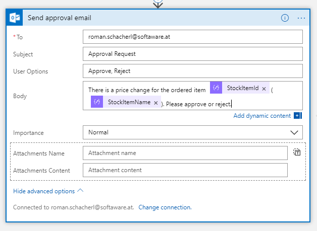

* Based on the decision of the approval mail you can define different actions. Click on *Next step* and *Add a condition*.

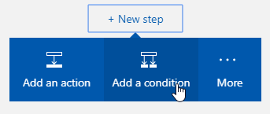

* If the *Selected Option* of your approval mail *is equal to* *Approve*, you send another message with the corrected price to your *orders queue*


* Choose the *send message* action of the *Service Bus* connector

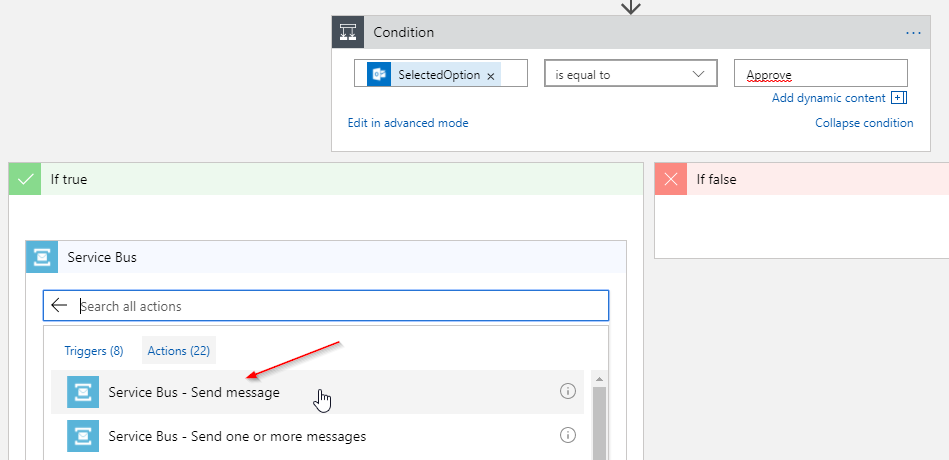

* Choose the existing Service bus for your connection and name it


* Specify the *topic name*, set the *content* to a valid JSON object and specify the supplier id in the *properties*

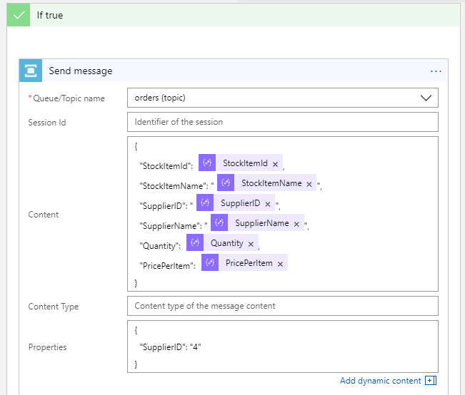

* Save the logic app and copy the *callback url*

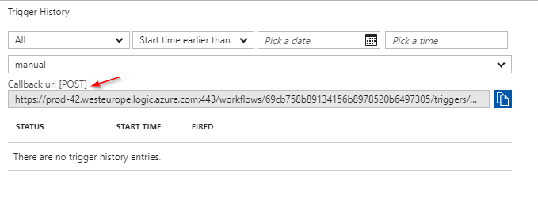

* Use a tool like [Postman](https://chrome.google.com/webstore/detail/postman/fhbjgbiflinjbdggehcddcbncdddomop) to simulate a POST request and trigger you Logic App.

```json
{
  "StockItemId": 80, 
  "StockItemName": "The Gu red shirt XML tag t-shirt (White) M", 
  "SupplierID": 4, 
  "SupplierName": "Fabrikam, Inc.", 
  "Quantity": 100, 
  "PricePerItem": 18.0 
}
```

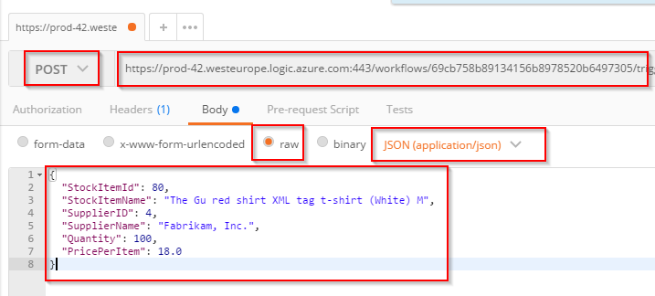

* Watch how the Logic App gets triggered


* The workflow stops at the approval step and waits for an answer


* Check your email inbox for approval mails and click on *Approve*

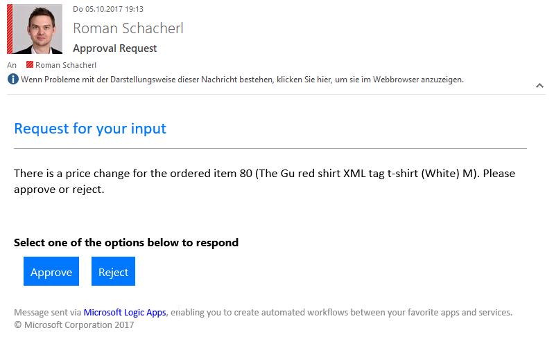

* The logic app will continue the workflow and run to the end

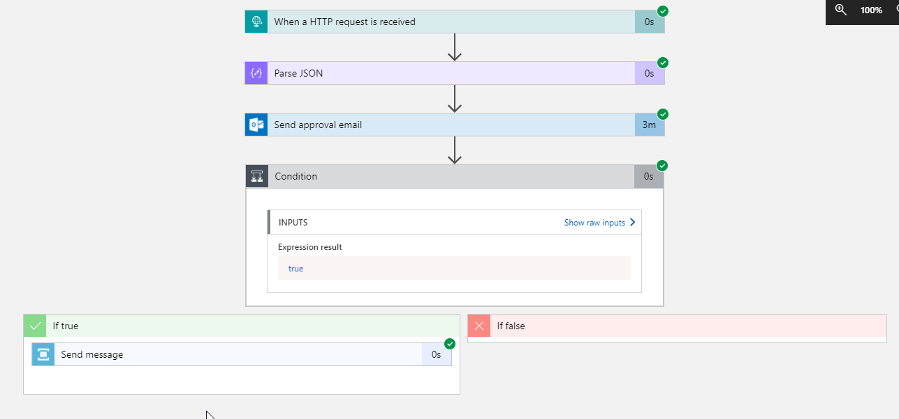

* Because of the created filtered subscription our Azure function app with trigger again and send a request.

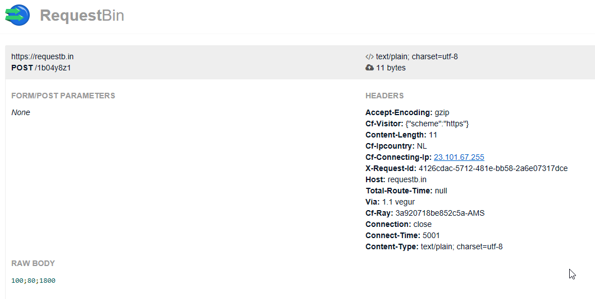


## Additional information
* [Filter expressions for Servicebus Topics](https://docs.microsoft.com/en-us/azure/service-bus-messaging/service-bus-messaging-sql-filter)
* [Service Bus Explorer](https://github.com/paolosalvatori/ServiceBusExplorer)