# Monitoring

## Content
The forth block concentrates on the importance of professional monitoring and telemetry:
* How does monitoring and logging differ in complex cloud-based apps compared to legacy monoliths?
* How telemetry influences user satisfaction and conversion/churn rates
* Telemetry and Microservices
* Microsoft’s related offering in Azure: Application Insight

## Material
This block contains presentations and demos/hands-on exercises. Slides about
* logging,
* telemetry,
* cloud pricing models, 
* practical problems and their solution with AI, and
* Application Insights in general
will be provided. 

A step-by-step description of the following demos will be created:
* Visual Studio: Use AI data during development
* AI portal: View telemetry and logs of previously deployed services
* AI Analytics: Find answers to specific questions
* AI Maps

## Using Application Insights
In this lab we will add Application Insights (AI) to a Web application and see how it helps during development.

### Create a new Web application and configure AI
* Open *Visual Studio 2017*
* Create a new *ASP.NET Core Web Application*

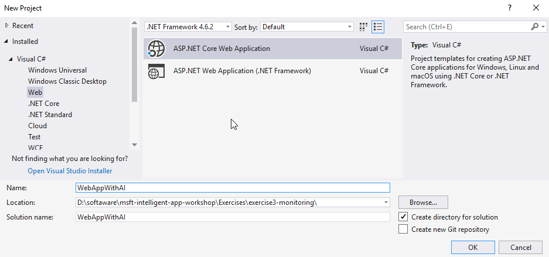

* Choose the *Web Application (Model-View-Controller)* template and create the project

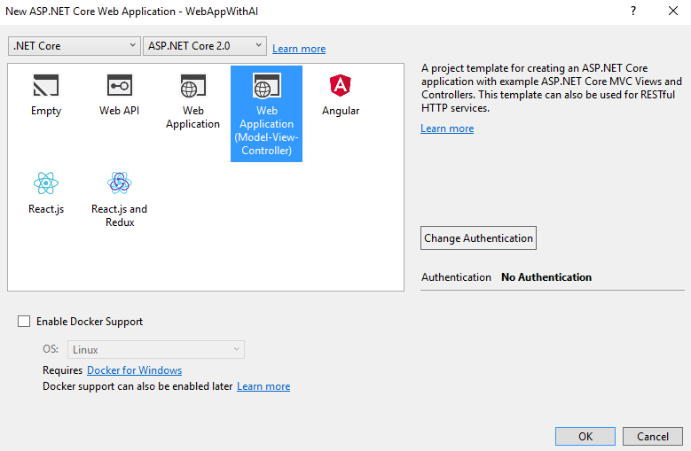

* Let's add Application Insights to this new project by using the context menu.

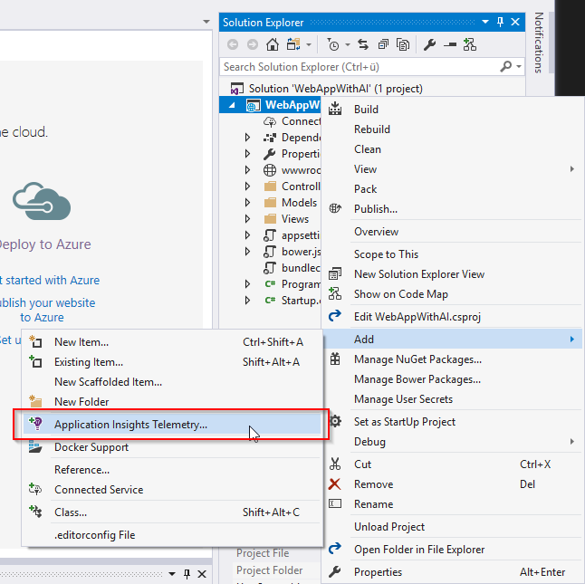

* Click on *Start Free* to configure your AI resource
* Choose an *Azure subscription*
* Click on *Configure settings* to choose the *Resource group*, a name for the *Application Insights Resource* and a *Location*
* Decide, if you want to stop collecting data after 1 GB/Month to remain in the free plan.

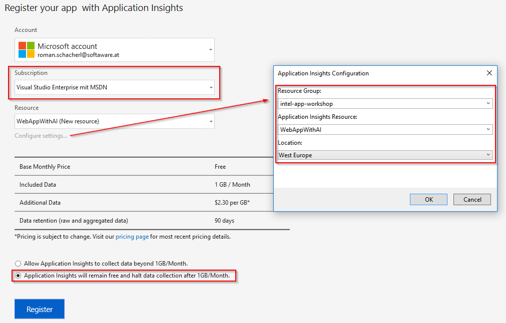

* Click on *Register*, your Application Insights Resource is being created now.

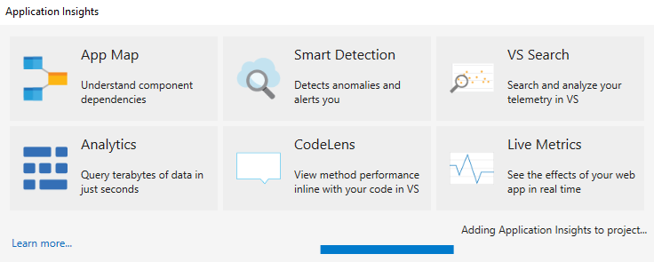

### See telemetry data
* Start your web application and click through a few pages
* While you are debugging your application, Visual Studio can show telemetry data from the current debug session. Click on the *Application Insights* button in your menu bar to open the *Application Insights Search* window.


* You see all requests, errors, dependency failures, etc. on one place - currently filtered to your debug session. 
* You can filter the telemetry data by time, HTTP method, request, response code, etc.


* Let's change some lines of code to produce an exception. We will make a HTTP request to an unreachable URL. Open the *Controllers/HomeController.cs* file and add the below using block. Be also aware of the changes in the method signature (*async* keyword and return type of *Task<IActionResult>*).

```cs
public async Task<IActionResult> About()
{
    ViewData["Message"] = "Your application description page.";

    using (var client = new HttpClient())
    {
        var result = await client.GetStringAsync("http://request-to-nothing.com");
    }

    return View();
}
```

* Start a new debugging session, click on the About page and see the *Application Insights* telemetry data again.
* You'll see the exception and the dependency on the external service.


* In the exception details you can jump directly to the code

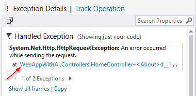

* Application Insights integrates into CodeLens, you see the amount of requests and failures and all the exceptions that occured in your method. Currently you are filtered to your debugging session, but you can get the same experience for production data as well.


## Application Insights Trends
* To see some useful test data, we should slow down one of your pages a little bit.
* Open the *Controllers/HomeController.cs* file and add an increasing delay to the *Index* action.

```cs
private static int delay = 200;

public async Task<IActionResult> Index()
{
    await Task.Delay(delay);

    delay = delay * 2;

    return View();
}
```

* Start a new debugging session.
* From the Application Insights menu you can open additional views. Try out *Explore Telemetry Trends*.

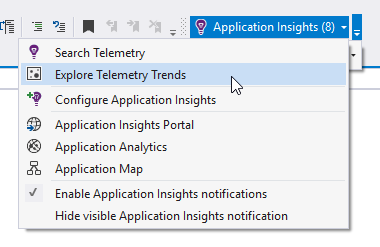

* Use the *Application Insights Trends* view to visualize your data over time and group by Performance, Country, Request, etc.

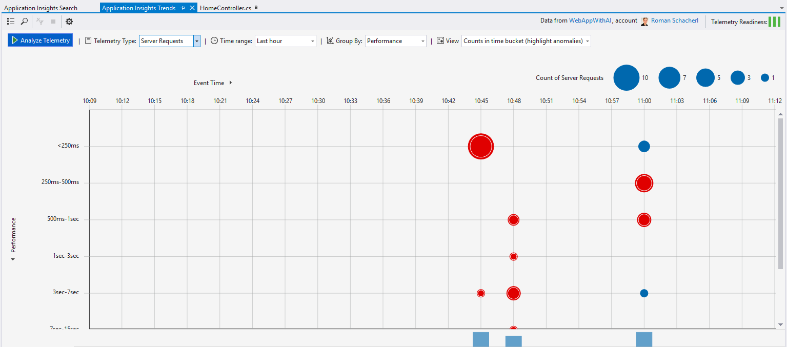

## Application Insights Portal

* Additionally you can view the telemetry data in the Azure portal.

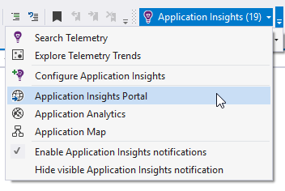

* Explore the different views, click through some requests and exceptions. Show the *performance view* when clicking on the server response time.

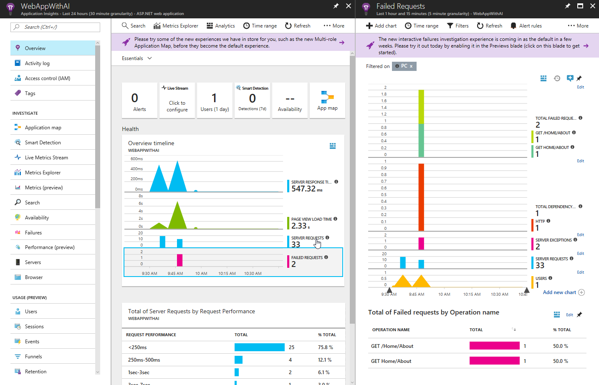

## Availability tests
* You can create availability tests to ensure that your services are up and running.
* Click on *Availability* in your Application Insights Azure Portal


* Click on *Add test* and show the options to create a test. As you didn't publish your website, you can cancel the creation of the test for now.

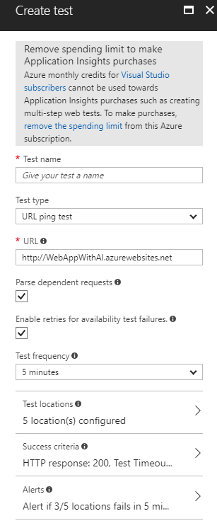

## Analytics
* Open *Analytics* from your Azure Portal.


* Explore the *Analytics* window and maybe switch to the [*Demo workspace*](https://analytics.applicationinsights.io/demo) to see more relevant data.

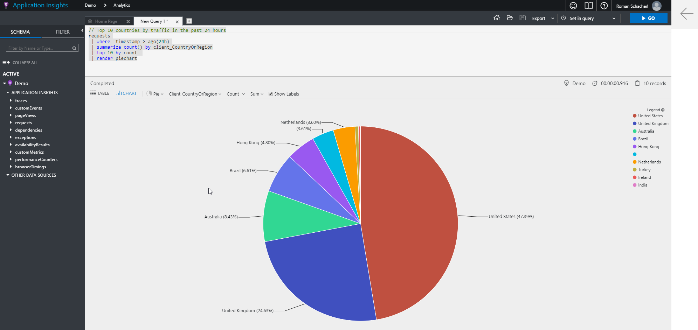

## Application map
* The [*Application map*](https://docs.microsoft.com/en-us/azure/application-insights/app-insights-app-map) shows all the components of your application and how they work together.


## Integrate EF Core 2

> **Important**: With the following sample you can integrate a database access with Entity Framework Core 2 to your web app. Unfortunately there was no Application Insights support for EF Core 2 at the time this training material was created. Check out the [Roadmap](https://github.com/aspnet/EntityFrameworkCore/wiki/Roadmap), maybe EF Core 2.1 is already released and AI support is included.

* Let's add some database code to our web app.
* Add the NuGet package *Microsoft.EntityFrameworkCore.SqlServer* to your project.


* Create a *Data* folder in your project (for demo reasons we pass on creating a multi-tier application)
* Add a class named *Supplier*

```cs
[Table("Suppliers", Schema = "Purchasing")]
public class Supplier
{
    public int SupplierID { get; set; }

    public string SupplierName { get; set; }
}
```

* Add a class named *WWIContext*

```cs
public class WWIContext : DbContext
{
    public WWIContext(DbContextOptions options) : base(options)
    {
    }

    public virtual DbSet<Supplier> Suppliers { get; set; }
}
```

* In the *Startup.cs* file modify the existing *ConfigureServices* method and configure your database context for dependency injection

```cs
public void ConfigureServices(IServiceCollection services)
{
    services.AddMvc();

    services.AddDbContext<WWIContext>(options =>
        options.UseSqlServer(Configuration.GetConnectionString("WWIDatabase")));
}
```

* Open the *appsettings.json* file and add your connection string

```json
{
  "ConnectionStrings": {
    "WWIDatabase": "Server=tcp:intel-app-workshop.database.windows.net,1433;Initial Catalog=WWI-Standard;Persist Security Info=False;User ID=demo;Password=xxx;MultipleActiveResultSets=False;Encrypt=True;TrustServerCertificate=False;Connection Timeout=30;"
  }
}
```

* Add a constructor to your *HomeController*, the *WWIContext* instance is injected

```cs
private WWIContext db;

public HomeController(WWIContext db)
{
    this.db = db;
}
```

* Modify your *Contact* action and add some database code

```cs
public IActionResult Contact()
{
    ViewData["Message"] = "Your contact page.";
            
    var suppliers = this.db.Suppliers.ToList();
            
    return View();
}
```
