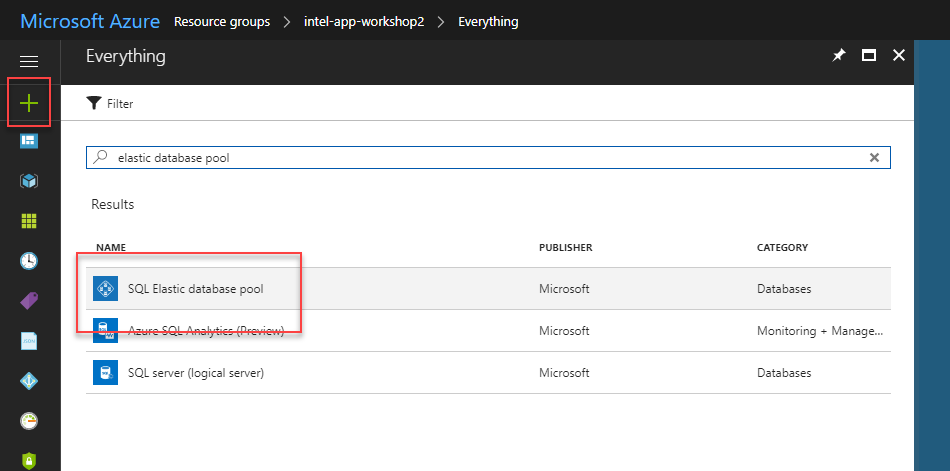
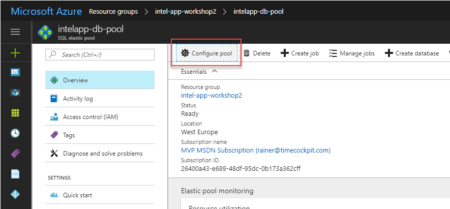
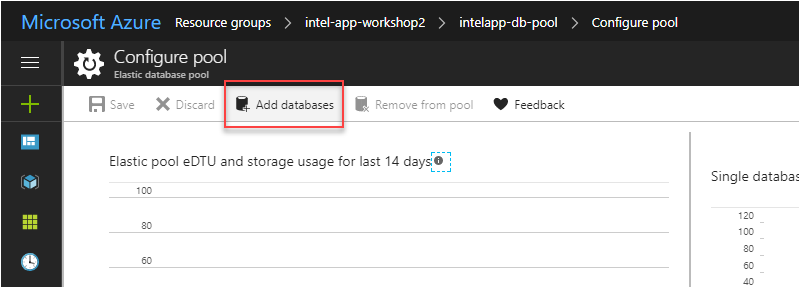
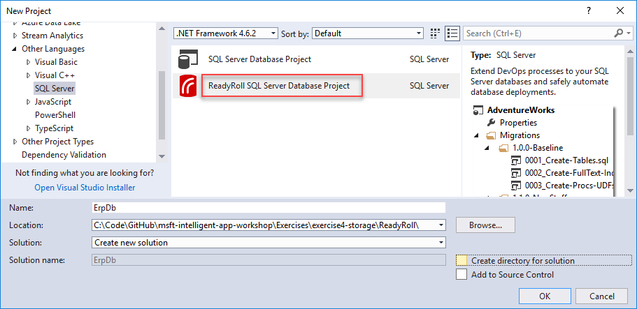
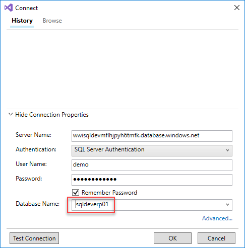
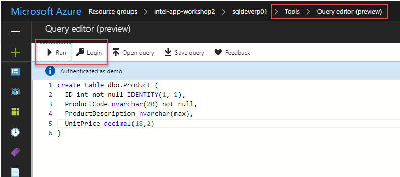
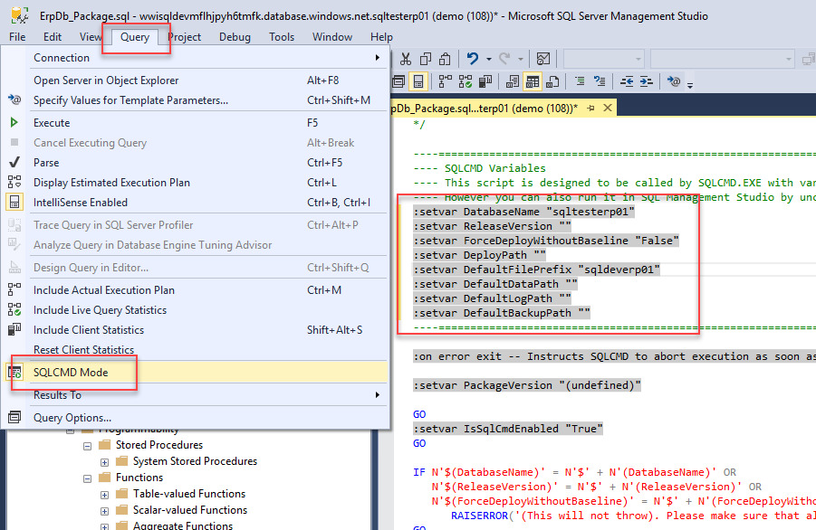

# Exercise 4: Storage

## Content

This part focuses describes how intelligent apps benefit from “polyglot persistence” in terms of technology and business models:
* Short recap: SQL vs. NoSQL
* Multi-tenancy and storage
* Different storage needs (e.g. OLTP, OLAP, archives)
* Different storage architectures (e.g. Service Fabric’s approach, dedicated storage services)
* Microsoft’s related offerings in Azure (e.g. CosmosDB, Azure SQL, OSS databases, Redis, Search)


## Material

This block contains presentations and demos/hands-on exercises. Slides about
* storage types,
* storage architectures,
* storage pricing models, and
* related Azure services (e.g. CosmosDB, Azure SQL, OSS databases, Redis, Search)
will be provided. A step-by-step description of the following demos will be created:
* Azure SQL: Sharding with Azure SQL Elastic DB Pools
* Azure SQL: Redgate DB tools in VS Enterprise
* CosmosDB: Document-oriented storage with DocumentDB API


## Sample
### Scenario
* Feature request: Manage support cases
* We want to create a new Microservice
* Independent Storage, decision: NoSQL 

### Steps
* Create a .NET Core application
* Access Cosmo DB
* ASP.NET 4.7 Frontend (no SPA)

### Responsibility
* Rainer


# Lab 1 - Elastic Database Pools

## Introduction

> Note that this lab build on the deployed results of the labs in [exercise 1](https://github.com/software-architects/msft-intelligent-app-workshop/tree/master/Exercises/exercise1-devops).

WWI has started to experiment with *Azure SQL Databases*. Their development database already runs in Azure (this is the database you deployed and used in exercise 1). Now they want to create a test environment to which they can deploy release candidates for the testing team. Over time, they expect to have multiple test and development environments. Additionally, they will have multiple production environments for different countries. Different countries will sometimes run different versions of WWI's ERP system.

> Discuss how *Azure SQL Elastic Database Pools* can help WWI to save money.

## Elastic Database Pools

> Note to presenters: If you have limited time, skip this live demo and prepare the database pool before the workshop.

* Open the *Azure Portal* and navigate to the *Resource Group* you created in exercise 1.

* Start creating a new Elastic Database Pool:



* Create the Pool with the following options (note that your server name will be different):


* Once the Pool has been created, open the Pool's configuration:



* Add the existing development database to the pool:



* Create a new test database in the pool:


* The new test database must be assigned to the pool, too:


Now we have both the development and the test database in the Elastic Database Pool.


# Lab 2 - Database DevOps

## Introduction

The development team at WWI has developed guidelines for doing structural database changes (e.g. new table, new column, etc.). They have a special folder in source control where developers store manually created DB maintenance SQL scripts. When releasing a new version, an administrator executes the scripts before putting the new application in production.

The current practice has frequently led to bugs. Here are some examples:

1. Sometimes developers forget to create maintenance scripts. They change the development DB manually via *SQL Server Management Studio*.
1. Sometimes scripts get lost (e.g. not added to TFS source control).
1. Human mistakes happen (e.g. forget one script during deployment) rather often.
1. Scripts are of poor quality (e.g. not idempotent).

> Discuss what WWI should change in terms of database development and DevOps.

## Conclusions

* WWI wants to automate the creation of DB maintenance scripts.
* WWI wants to automate the deployment of DB maintenance scripts.

## Database DevOps

> Note to presenters: If you have limited time, open the ready-made [*ReadyRoll* solution](ReadyRoll/ErpDb/) instead of creating it from scratch.

* Start *Visual Studio 2017* and create a new *ReadyRoll* project:



* Connect ReadyRoll with your Azure database. Note that you should explicitely switch to the network protocol *Tcp/Ip* in the *Advanced Settings* for databases in Azure.



* Import the existing development database in the new project. As a result, ReadyRoll will create an initial migration script with the existing `Order` table.


> Note to presenters: Describe the concept of migration script. Consider showing the changes that *ReadyRoll* made to the development database (in particular `__MigrationLog` table).

* Open the development DB in *SQL Server Management Studio* (SSMS) or in the Azure Portal's *Query Editor*:



* Create a new table by executing the following SQL script. If you prefer, you can also create the table using interactive table designer in SSMS.

```
create table dbo.Product (
  ID int not null IDENTITY(1, 1),
  ProductCode nvarchar(20) not null,
  ProductDescription nvarchar(max),
  UnitPrice decimal(18,2)
)
```

* Switch back to ReadyRoll in Visual Studio. Hit *Refresh* so that ReadyRoll can detect the changes you made to the DB:


* Note that ReadyRoll has recognized the new table. *Import and generate* a migration script for the new table. Note that you can manually change or extend the file if necessary.


* Build the project in Visual Studio. Take a look at the generated files in `bin/Debug/`.

> Note to presenters: Describe the generated *.sql* and *.ps1* files. Point out that the files are created for the *SQLCMD* tool.

* Open the generated *.sql* file in SSMS.

* Connect SSMS with the target database, i.e. the new test database.

* Switch SSMS into *SQLCMD Mode* and uncomment the *SQLCMD Variables* section:



Now you can run the generated migrations. Your test database will be updated accordingly.

Note that ReadyRoll build and deploy can be integrated in your VSTS build and release pipeline. The necessary step is available for free in the *VSTS Marketplace*:


Once you have installed this step, you can add it to your build and/or release definitions:


