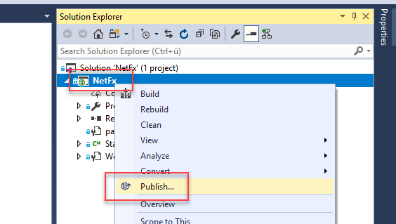
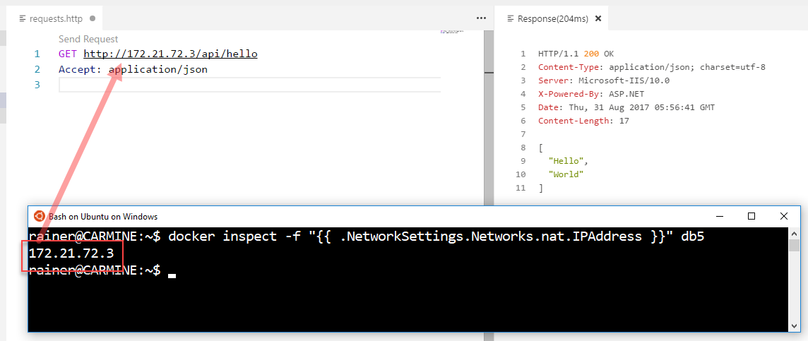

# Lab 1 - .NET Framework in Docker

## Introduction

WWI has multiple development teams. While the ERP team has been bound to Windows because of their usage of C# and .NET Framework, other teams (e.g. web team) use Linux as their server operating system. These teams are also using Docker for running their applications in containers. They are very happy with this step.

On the long run, the ERP teams wants to switch entirely to .NET Core to become platform-neutral. The ERP solution should run on Windows and on Linux. The admin team should freely choose the best platform for the each scenario. However, given the limited resources, the migration to .NET Core will be a multi-year journey.

The ERP team thinks about ways to solve urgent problems that have to be solved on the short run and cannot wait until the .NET Core migration has finished. Some of these problems are:

1. Today, many applications share a single VM. This often leads to problems in production as updates for one application negatively influence other applications on the same server.
1. Because of the problems described in the previous point, developers and admin tend to use one VM per application. However, this has led to long waiting times for VMs (up to one month waiting time for a single VM) because the computer rooms as WWI are running on their capacity limits.
1. As mentioned before, deployment of application is currently a manual process. Developers have to write lengthy manuals that admins follow during installation. This way of working is quite error-prone.

> Discuss what the ERP team could do to solve these problems for .NET Framework (not .NET Core) applications.


## Conclusions

* WWI wants to run their .NET Framework server components in Windows containers.
* Developers will use *Docker for Windows* during development.
* For production, containers will run on *Windows Server 2016*.

## Windows Containers with ASP.NET

For this lab, we have prepared a very simple ASP.NET Web API project [*NetFx*](NetFx). It does not contain noteworthy logic. It just responds to `GET http://some-ip/api/hello` with `["Hello", "World"]`. We want run this sample application in a Windows container.

* Open the [*NetFx*](NetFx) project in Visual Studio.

* Build to project and run it locally in the debugger. It should respond to `GET http://localhost:<your-port>/api/hello`.

* Publish the project to the folder `PublishOutput`.



* Make sure you have switched your local Docker installation to Windows containers:


* In the project folder [*NetFx/NetFx*](NetFx/NetFx) create a file called `Dockerfile`. We recommend editing it in *Visual Studio Code*.

* Enter the following code in the *Dockerfile*:

```
FROM microsoft/aspnet:4.6.2
COPY ./PublishOutput/ /inetpub/wwwroot
```

> Note to presenters: Speak about Windows base images provided by Microsoft (in particular `microsoft/dotnet` and `microsoft/aspnet`).

* Open a command shell or bash shell (depending on whether you want to run the Docker client on Windows or Linux) and navigate to the directory where your *Dockerfile* is stored.

> Note to presenters: Describe the possibility of Windows 10 to run Linux terminals on top of the Windows kernel without having to use VMs.

* Build the image with `docker build -t netfx .`

* Run the image with `docker run -d --name netfxapi netfx`

> Note to presenters: Speak about the difference of Windows Server containers and Hyper-V containers.

* Unfortunately, you cannot access the running application via `localhost`. At the time of writing, this is a [limitation of Windows containers](https://docs.microsoft.com/en-us/aspnet/mvc/overview/deployment/docker-aspnetmvc#verify-in-the-browser). Use the command `docker inspect -f "{{ .NetworkSettings.Networks.nat.IPAddress }}" netfxapi` to find out the IP address of the Windows container. Use it to test your containerized app:



* Optionally, you can create a new *Windows Server 2016* VM in Azure and try to re-run the above steps there.


# Lab 2 - .NET Core in Docker

## Introduction

The ERP team has started to refactor their application. They extracted first Microservices into separate projects and moved them to .NET Core. Because of that, they can now use Linux Docker containers for .NET.

> Discuss options to run Linux Docker containers on-premise and in Azure. Consider in particular *Azure Container Service* and *Azure Container Instances*.

## Linux Containers with ASP.NET

For this lab, we have prepared a very simple ASP.NET Core Web API project [*NetCore*](NetCore). It does not contain noteworthy logic. It just responds to `GET http://some-ip/api/hello` with `["Hello", "World"]`. We want run this sample application in a Linux container.

* Open a command shell or bash shell (depending on whether you want to run .NET Core on Windows or Linux) and navigate to the [*NetCore*](NetCore) directory.

* Run the .NET Core application locally with `dotnet run`. It should respond to `GET http://localhost/api/hello`.

* Make sure you have switched your local Docker installation to Linux containers:

* In the project folder [*NetCore*](NetCore) create a file called `Dockerfile`. We recommend editing it in *Visual Studio Code*.

* Enter the following code in the *Dockerfile*:

```
FROM microsoft/dotnet:2-sdk AS build-env
WORKDIR /app

COPY *.csproj ./
COPY *.cs ./
RUN dotnet restore && dotnet publish -c Release -r linux-x64 -o out

FROM microsoft/aspnetcore:2
WORKDIR /app
COPY --from=build-env /app/out ./
ENTRYPOINT ["./NetCore"]
```

> Note to presenters: Speak about multi-step build as shown in the code sample above. Additionally, speak about Linux base images provided by Microsoft (in particular `microsoft/dotnet` and `microsoft/aspnetcore`).

* Build the image with `docker build -t netcore .`

* Run the image with `docker run --rm --name netcoreapi -p 8080:80 netcore`

> Note to presenters: Speak about the difference of interactive and daemonized containers and port mappings.

* Test your containerized .NET Core app. It should respond to `GET http://localhost:8080/api/hello`.


# Additional Labs

> Note to presenters: You can use these labs if you have time left to fill. You can also suggest it to people who are very fast and need additional challanges.

## Publish to Docker Hub

> Note to presenters: Talk about the differences of the public [Docker Hub](https://hub.docker.com) vs. private container registries built with the [Azure Container Registry](https://azure.microsoft.com/en-us/services/container-registry/) service.

* Create an account on the [Docker Hub](https://hub.docker.com). Let's assume your account is called `johndoe`.

* When building the .NET Core image as shown above, [tag](https://docs.docker.com/engine/reference/commandline/tag/) it with your user account: `docker build -t johndoe/netcore .`

* Login to Docker Hub using the Docker CLI: `docker login --username johndoe --password YourPassword`

* Publish your .NET Core image to Docker Hub: `docker push johndoe/netcore`

* Open [Docker Hub](https://hub.docker.com), login with your account, and check whether publishing has been successful.

## Run Web App Container in [Azure App Service](https://docs.microsoft.com/en-us/azure/app-service/containers/)

* Open [Azure Portal](https://portal.azure.com)

* Create a new *Web App for Containers*:


* Once the deployment has finished, show that the .NET Core application is now running in Azure.

## Run Container in *Azure Container Instance*

Follow the [quickstart tutorial about *Azure Container Instances*](https://docs.microsoft.com/en-us/azure/container-instances/container-instances-quickstart) but use your image.

## Docker Support in Visual Studio 2017

Try the [tutorial for Docker in Visual Studio 2017](https://docs.microsoft.com/en-us/dotnet/core/docker/visual-studio-tools-for-docker) to see how Docker is supported in Visual Studio.
