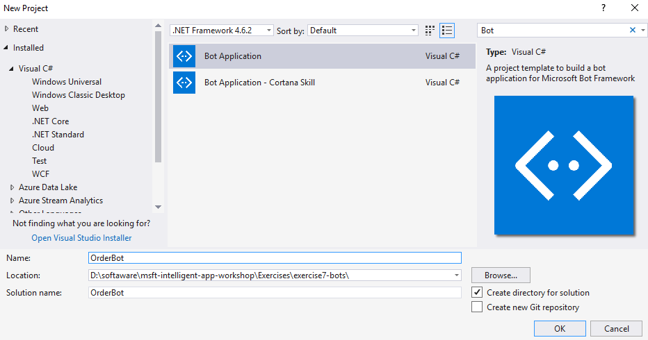

# Bots

## Content
This part covers new UI paradigms for innovative apps:
* Short recap: New UI paradigms
* Consequences of new UI paradigms on software development
* Microsoft’s related products and offerings (e.g. Hololens, bot framework)

## Material
This block contains presentations and demos/hands-on exercises. Slides about
* programming bots,
* programming Hololens (just short overview to understand necessary skills),
* Implications of new UI paradigms on software development (e.g. required skills), and
* related Microsoft products and services
will be provided. A step-by-step description of the following demos will be created:
* Build a simple bot with Microsoft Bot Framework
Note that this block concludes day 2 of the workshop. Therefore, it contains a bit less material and content in order to have enough time for closing Q&A, discussions, etc.

## Sample
### Scenario
* Create an order bot
* Ask the bot "Order an action jacket" -> more than one result
* Ask for the size
* Send a card for the chosen product
* Order

## Create a Hello, world-Bot

### Installation

* The [Microsoft Bot Framework](https://dev.botframework.com) is provided as a *NuGet package*
* There are *project templates* available for Visual Studio:
  * Download from [Bot Framework SDK and tools](https://docs.microsoft.com/en-us/bot-framework/resources-tools-downloads)
  * Copy the ZIP files to _%userprofile%\documents\Visual Studio 2017\Templates\ProjectTemplates\Visual C#_
* Download the *Bot Framework Channel Emulator* and execute the setup
  * [BotFramework-Emulator](https://github.com/Microsoft/BotFramework-Emulator/releases)

### Create a new project
* Create a new project with the **Bot Application** template and call it **OrderBot**



* Update the **Microsoft.Bot.Builder** NuGet package to the newest version.

### Hello, Bot
* The project template already provides a small bot implementation, take a look at *Controllers/MessagesController.cs*

```cs
public async Task<HttpResponseMessage> Post([FromBody]Activity activity)
{
    if (activity.Type == ActivityTypes.Message)
    {
        await Conversation.SendAsync(activity, () => new Dialogs.RootDialog());
    }
    else
    {
        HandleSystemMessage(activity);
    }
    var response = Request.CreateResponse(HttpStatusCode.OK);
    return response;
}
```

* The Post action refers to the existing *RootDialog* (*Dialogs/RootDialog*)

```cs
[Serializable]
public class RootDialog : IDialog<object>
{
    public Task StartAsync(IDialogContext context)
    {
        context.Wait(MessageReceivedAsync);

        return Task.CompletedTask;
    }

    private async Task MessageReceivedAsync(IDialogContext context, IAwaitable<object> result)
    {
        var activity = await result as Activity;

        // calculate something for us to return
        int length = (activity.Text ?? string.Empty).Length;

        // return our reply to the user
        await context.PostAsync($"You sent {activity.Text} which was {length} characters");

        context.Wait(MessageReceivedAsync);
    }
}
```

### Execute the bot
* Start your web application
* Copy the deployment url (e.g. http://localhost:3979/)
* Start the **Bot Framework Channel Emulator**
* Set the endpoint URL to the address with appended */api/messages* 
* Start chatting


